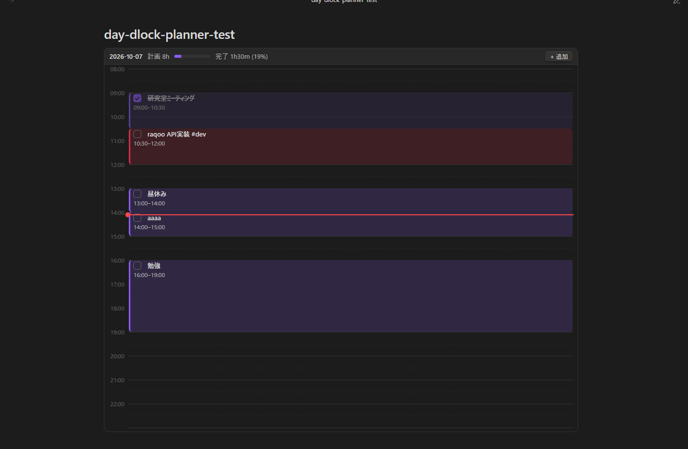
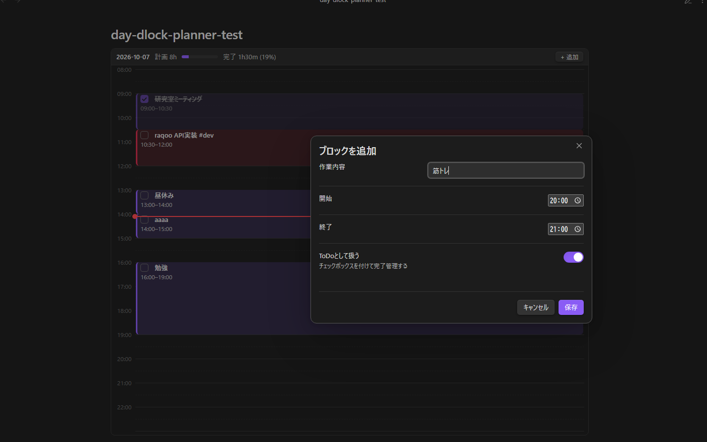

# Day Block Planner (Obsidian plugin)

ノートの中に Google カレンダーの「1日ビュー」のようなものを埋め込み、ブロックをドラッグで動かせるプラグイン。





## 書き方

````markdown
```dayplan
date: 2026-10-07
start: 08:00
end: 23:00
---
- [x] 09:00-10:30 研究室ミーティング
- [ ] 10:30-12:00 raqoo API実装 #dev
13:00-14:00 昼休み
```
````

| 行 | 意味 |
|---|---|
| `- [ ] HH:MM-HH:MM タイトル` | ToDoブロック(チェックで完了) |
| `HH:MM-HH:MM タイトル` | 普通のブロック |
| `#tag` | タグごとに自動で色分け |
| `---` より上 | 設定(すべて省略可): `date` `start` `end` `step` `hourHeight` |

`date` が今日のときだけ現在時刻の赤線が出る(省略時は常に表示)。

## 操作

| 操作 | 動作 |
|---|---|
| ブロックをドラッグ | 移動(`step` 分単位でスナップ) |
| ブロックの上端/下端をドラッグ | 開始/終了時刻を変更 |
| 空き領域をドラッグ | その範囲で新規作成 |
| 空き領域をダブルクリック | 1時間ブロックを新規作成 |
| ブロックをダブルクリック | タイトル・時刻を編集 / 削除 |
| 右クリック | 編集・完了切替・直後に複製・削除 |
| ドラッグ中に Esc | キャンセル |
| コマンド「今日のタイムラインを挿入」 | 今日の日付入りブロックを挿入 |

Live Preview / ソースモードでの変更は `Ctrl+Z` で取り消せる。

## インストール

1. `<Vault>/.obsidian/plugins/day-block-planner/` を作成
2. `main.js` `manifest.json` `styles.css` をコピー
3. Obsidian → 設定 → コミュニティプラグイン → 再読み込みして有効化

## 開発

```bash
npm install
npm test        # model層のユニットテスト
npm run build   # tsc 型チェック + esbuild バンドル
npm run dev     # watch ビルド
```

### コードを書き換えた後に Obsidian に反映させたいとき

1. `npm run build` を実行
2. `main.js` と `styles.css` を `<Vault>/.obsidian/plugins/day-block-planner/` にコピーして置き換える（cssに変更がなければmain.jsだけでOK）
3. Obsidian → 設定 → コミュニティプラグイン → 再読み込み
4. 一度 Day Block Planner プラグインを一度オフにして、再度オンにする

## アーキテクチャ

```
 Markdown (```dayplan```)  ── single source of truth
        │ registerMarkdownCodeBlockProcessor
        ▼
 ┌─────────────── main.ts ───────────────┐
 │ Plugin: 設定 / コマンド / Processor登録 │
 └──────────────────┬────────────────────┘
                    ▼
 ┌─ view.ts (MarkdownRenderChild) ───────────────┐
 │ render(): Plan → DOM                          │
 │ Pointer session: drag中はDOMだけ更新(書込なし) │
 │ commit(): Plan複製→変更→serialize→writer      │
 └───────┬───────────────────────┬───────────────┘
         ▼                       ▼
 ┌─ model.ts (純粋関数) ─┐  ┌─ persistence.ts ─────────────────┐
 │ parse / serialize     │  │ CodeBlockWriter                  │
 │ layoutBlocks(重なり)  │  │  編集中: Editor.replaceRange(undo可)│
 │ applyDrag / snap      │  │  閲覧中: Vault.process(原子的)    │
 └───────────────────────┘  │  CAS: 本文が描画時と一致時のみ書込 │
                            └──────────────────────────────────┘
```

- **model は Obsidian 非依存** → Node 標準のテストランナーで単体テスト可能
- **書き込みは pointerup の1回だけ** → ドラッグ中にファイルI/Oが走らない
- **楽観的並行性制御**: 描画時のテキストと現在のテキストを比較し、別所で編集されていたら上書きせず中止(同期ツールや別ペインとの競合対策)
- 未知の行は捨てずに保持するので、メモを書き足しても壊れない
